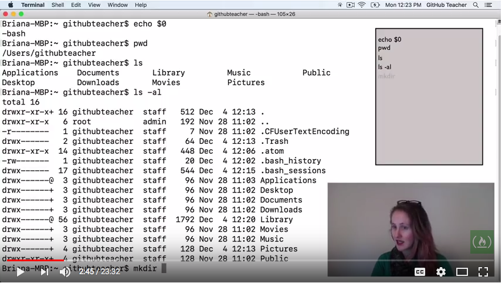

# Learn to use the command line

This guide is meant to be used as a companion of a workshop that we teach every now and then at [Turn into Coders](http://www.turnintocoders.com). But you can find this useful to get a collection of links and ideas.

## Step 0

### With GNU/Linux

If you don't know how to get to the command line, you can start from these [basic tasks for new Linux users](http://www.ibm.com/developerworks/linux/tutorials/l-basics/).

### With Windows

You can get the Bash terminal with the [Windows subsystem for Linux](https://docs.microsoft.com/en-us/windows/wsl/about). This will lead to installing a terminal that will allow you running most commands.

The alternative (or if you have Windows older than 10) is installing Linux, using a live version or accessing a remote web-IDE, like [CodeAnywhere](https://codeanywhere.com/) which is free for our purposes.

### With Mac

You can find the Terminal inside the Apps > Utility folder.

## Gentle introduction

## Topics

This an outline of topics and commands covered in the workshop.

- philosophy, minimalism, one tool does one thing (well)
- basic concepts, the shell is a program that runs builtin commands, programs or scripts (which are a series of programs)
- data moves from one command to another in form of plain text
- touch typing is important. Pick one of these and practice (you should get at least to 60~70 wpm) https://typing.io/ gtypist https://www.keybr.com/ https://www.typingclub.com/ http://play.typeracer.com/
- case sensitivity
- basic commands (`pwd`, `ls`, `cd`, `mkdir`, `cp`, `mv`, `rm`, `ln`)
- I/O: pipe, redirect, stdin, stdout, stderr
- ctrl+c, z, d
- &, `fg`, `kill`
- arrows, ctrl+arrow, home end, tab
- `history`, ctrl+r
- `less`, `tail`, `cat`, `head`
- moving around in files (/, hjkl, q)
- `man`, -h
- `top`, `uptime`, `ifconfig`, `apt`, `kill`, `chown`, `chmod`, `du`, `grep`, `find`, `wc`
- accounts/permissions
- `su`, `sudo`
- `nano`, `vi`
- standard folders
- `export`
- script
- zsh - [Oh My Zsh](http://ohmyz.sh/)
- `alias`

## Tips & tricks

- Python server for static files, out of the box `python3 -m http.server 8000`

## Resources to move forward

[The Art of Command Line](https://github.com/jlevy/the-art-of-command-line)  
[IBM's Learn Linux, 101 - The Linux command line](https://www.ibm.com/developerworks/library/l-lpic1-103-1/index.html)  
[Learn Enough Command Line to Be Dangerous](https://www.learnenough.com/command-line-tutorial)  
[Exoteric \*nix terminal tutorial](https://github.com/patriciogonzalezvivo/Shell-Initiation)  
[Awesome shell](https://github.com/alebcay/awesome-shell)  
[An A-Z Index of the Bash command line for Linux](https://ss64.com/bash/)  
[Codecademy - Learn the command line](https://www.codecademy.com/learn/learn-the-command-line)  
